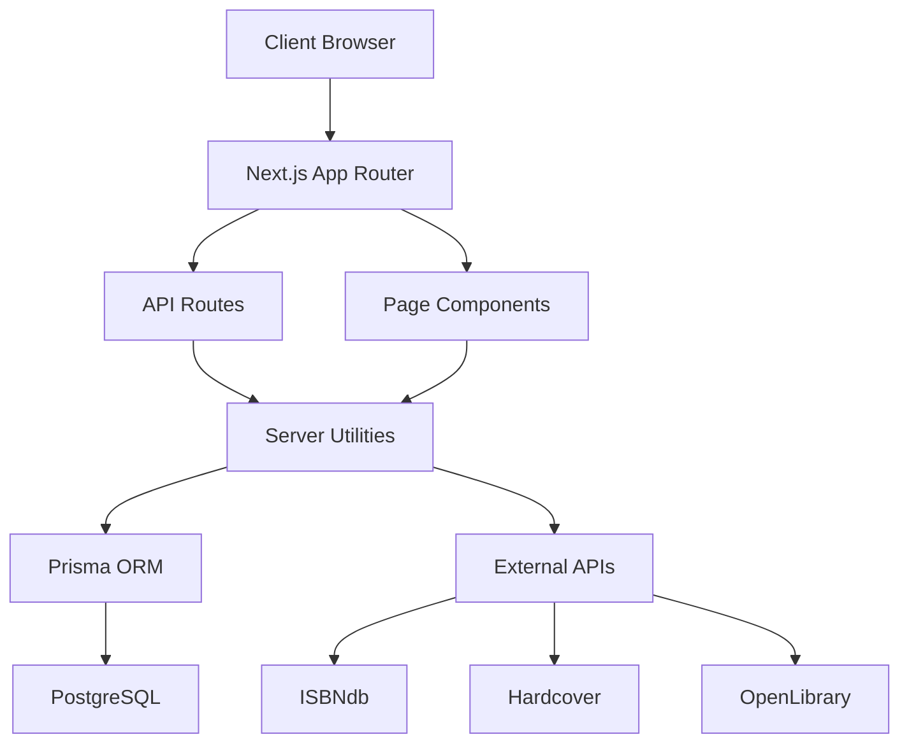

# IBDB Project Structure

## Overview

IBDB (Internet Book Database) is a Next.js 15 application built with TypeScript, Prisma, and PostgreSQL. It serves as a comprehensive book metadata aggregation service, providing both RESTful API endpoints and server-rendered web interfaces for book data lookup, author management, and duplicate detection.

## Architecture Overview



## Directory Structure

```
ibdb/
├── src/                        # Source code
│   ├── app/                    # Next.js App Router
│   │   ├── api/                # API routes
│   │   │   ├── admin/          # Admin endpoints
│   │   │   │   ├── duplicates/ # Duplicate detection system
│   │   │   │   │   ├── detect/ # Run detection scans
│   │   │   │   │   ├── merge/  # Merge duplicates
│   │   │   │   │   ├── stats/  # Statistics
│   │   │   │   │   └── route.ts
│   │   │   │   └── hardcover-queue/ # Queue management
│   │   │   │       ├── claims/ # Release processing claims
│   │   │   │       ├── cleanup/# Remove completed entries
│   │   │   │       └── reset/  # Reset queue
│   │   │   ├── authors/        # Author endpoints
│   │   │   │   ├── [id]/       # Individual author
│   │   │   │   └── route.ts    # Authors list
│   │   │   ├── books/          # Book endpoints
│   │   │   ├── search/         # Search endpoint
│   │   │   ├── book-json/      # Book JSON API (legacy)
│   │   │   ├── isbn-json/      # ISBN JSON API (legacy)
│   │   │   └── missing/        # External ID management
│   │   ├── admin/              # Admin UI pages
│   │   │   └── duplicates/     # Duplicate management UI
│   │   ├── author/[id]/        # Author profile pages
│   │   ├── book/[id]/          # Book detail pages
│   │   ├── isbn/[isbn]/        # ISBN lookup pages
│   │   ├── authors/            # Authors listing page
│   │   ├── books/              # Books search page
│   │   ├── layout.tsx          # Root layout
│   │   └── page.tsx            # Home page
│   ├── components/             # React components
│   │   ├── AuthorDetail.tsx    # Author profile display
│   │   ├── AuthorsList.tsx     # Authors list with filtering
│   │   ├── BookCard.tsx        # Book card component
│   │   ├── BookGrid.tsx        # Books grid with infinite scroll
│   │   ├── Home.tsx            # Homepage component
│   │   ├── SearchForm.tsx      # Search input form
│   │   ├── SearchResults.tsx   # Search results display
│   │   └── LoadingSpinner.tsx  # Loading indicator
│   ├── hooks/                  # Custom React hooks
│   │   ├── useInfiniteScroll.ts       # Generic infinite scroll
│   │   └── useAuthorsInfiniteScroll.ts # Authors-specific scroll
│   ├── lib/                    # Utility libraries
│   │   ├── authorDuplicateDetector.ts # Duplicate detection logic
│   │   └── testDuplicateDetection.ts  # Detection testing
│   ├── server/                 # Server utilities
│   │   ├── db.ts               # Database client singleton
│   │   ├── isbndb.ts           # ISBNdb API integration
│   │   └── hardcoverQueue.ts   # Queue management utilities
│   ├── types/                  # TypeScript types
│   │   └── home.ts             # Home page types
│   ├── api.d.ts                # API type definitions
│   ├── apiConvert.ts           # Data conversion utilities
│   └── middleware.ts           # Next.js middleware
├── prisma/                     # Database
│   ├── schema.prisma           # Schema definition
│   ├── migrations/             # Migration history
│   └── client/                 # Generated client
├── public/                     # Static assets
├── docs/                       # Documentation
│   ├── README.md               # Main documentation
│   ├── API_REFERENCE.md        # API documentation
│   ├── COMPONENTS.md           # Component documentation
│   ├── DATABASE_SCHEMA.md      # Database design
│   ├── DEPLOYMENT.md           # Deployment guide
│   ├── DEVELOPMENT.md          # Development setup
│   ├── PROJECT_STRUCTURE.md    # This file
│   └── dev-sessions/           # Development session notes
└── Configuration files
    ├── package.json            # Dependencies and scripts
    ├── tsconfig.json           # TypeScript configuration
    ├── next.config.ts          # Next.js configuration
    ├── tailwind.config.js      # Tailwind CSS configuration
    ├── postcss.config.js       # PostCSS configuration
    └── .env.example            # Environment variables template
```

## Core Components

### Application Layer (`src/app/`)

#### Pages
- **Home Page** (`page.tsx`): Landing page with infinite scroll book listing
- **Book Pages** (`book/[id]/`): Server-rendered book detail views
- **ISBN Pages** (`isbn/[isbn]/`): Direct ISBN lookup with automatic redirect
- **Author Pages** (`author/[id]/`): Author profiles with complete bibliography
- **Search Pages** (`books/`): Full-text search results interface
- **Admin Pages** (`admin/`): Protected administrative interfaces

#### API Routes
- **Public APIs**: Book search, retrieval, author listing
- **Admin APIs**: Duplicate detection, merge operations, queue management
- **Legacy APIs**: Backward-compatible endpoints for existing integrations

### Component Layer (`src/components/`)

- **Display Components**: BookCard, BookGrid, AuthorDetail, AuthorsList
- **Interactive Components**: SearchForm, SearchResults
- **Utility Components**: LoadingSpinner, Home
- **Layout Components**: Shared UI elements and wrappers

### Server Layer (`src/server/`)

#### Database Integration
- **Prisma Client** (`db.ts`): Singleton pattern for connection management
- **Connection Pooling**: Automatic connection reuse for performance
- **Transaction Support**: ACID compliance for data integrity

#### External Services
- **ISBNdb API** (`isbndb.ts`): Primary book metadata source
  - Rate limiting: 1 request per second
  - Automatic retry with exponential backoff
  - Response caching to minimize API calls

- **Hardcover Queue** (`hardcoverQueue.ts`): Background processing system
  - Claim-based processing with timeouts
  - Automatic cleanup of completed entries
  - Processing ID tracking for distributed workers

### Database Layer (`prisma/`)

#### Schema Design
- **Normalized Structure**: 3NF compliance with strategic denormalization
- **Entity Relationships**: Books ↔ Editions ↔ Authors with proper constraints
- **External IDs**: Integration points for OpenLibrary, Goodreads, Hardcover
- **Audit Tables**: AuthorMerge, DuplicateScanRun for tracking changes

#### Migration Strategy
- **Incremental Changes**: Version-controlled schema evolution
- **Rollback Support**: Reversible migrations where possible
- **Data Preservation**: Non-destructive schema updates

### Library Layer (`src/lib/`)

#### Duplicate Detection
- **Similarity Algorithms** (`authorDuplicateDetector.ts`):
  - Exact match detection
  - Name flip detection (First Last ↔ Last, First)
  - Fuzzy matching with Levenshtein distance
  - Confidence scoring (0-100%)

#### Testing Utilities
- **Detection Testing** (`testDuplicateDetection.ts`): Validation suite for algorithms

### Type System (`src/types/`, `src/api.d.ts`)

- **API Types**: Comprehensive TypeScript definitions for all endpoints
- **Database Types**: Generated from Prisma schema
- **Component Props**: Type-safe React component interfaces
- **Utility Types**: Shared type definitions and helpers

## Key Features

### Multi-Source Data Aggregation
- **Primary Source**: ISBNdb API for comprehensive book metadata
- **Secondary Sources**: OpenLibrary, Goodreads for additional data
- **Hardcover Integration**: Modern book platform with queue-based sync
- **Image Processing**: Automatic cover image metadata extraction with dimensions

### Performance Optimization
- **Query Caching**: Database-backed search result caching (BookQuery table)
- **Server Components**: React Server Components for reduced client bundle
- **Turbopack**: Fast development builds with hot module replacement
- **Connection Pooling**: Efficient database resource management
- **Infinite Scroll**: Lazy loading for large datasets

### Data Quality
- **Duplicate Detection**: Advanced author deduplication system
  - Multiple detection algorithms
  - Confidence scoring
  - Audit trail for merges
  - Batch processing support

- **Data Validation**: Schema-enforced constraints
  - ISBN-13 validation
  - Unique constraints on external IDs
  - Referential integrity

### Security & Access Control
- **Admin Authentication**: Secret-based admin endpoint protection
- **NextAuth Integration**: User authentication infrastructure
- **Environment Variables**: Secure configuration management
- **CORS Handling**: Controlled cross-origin access

## Technical Stack

### Frontend
- **Next.js 15.1.3**: React framework with App Router
- **React 19.0.0**: UI library with Server Components
- **TypeScript 5**: Type-safe JavaScript
- **Tailwind CSS 3.4**: Utility-first CSS framework

### Backend
- **Node.js**: JavaScript runtime
- **Prisma 6.1.0**: Type-safe ORM
- **PostgreSQL**: Relational database (via Neon)
- **Vercel**: Serverless deployment platform

### Development Tools
- **ESLint 9**: Code quality enforcement
- **Turbopack**: Fast bundler for development
- **tsx**: TypeScript execution for scripts
- **dotenv**: Environment variable management

## Data Flow

### Book Lookup Flow
```
1. User Request → Next.js Router
2. Router → API Route Handler
3. Handler → Database Check (cache)
4. If not cached → ISBNdb API Call
5. Store in Database → Transform to API format
6. Return Response → Client
```

### Duplicate Detection Flow
```
1. Admin Trigger → Detection Scan
2. Load Authors → Compare Pairs
3. Calculate Similarity → Store Results
4. Review Interface → Manual Verification
5. Merge Decision → Update Database
6. Audit Trail → Track Changes
```

### Queue Processing Flow
```
1. Book Missing Hardcover ID → Add to Queue
2. Client Claims Entry → Processing ID Assigned
3. External API Call → Retrieve Hardcover Data
4. Update Book → Remove from Queue
5. Timeout Handling → Release Stale Claims
```

## Environment Configuration

### Required Variables
- `DATABASE_URL`: PostgreSQL connection string
- `ISBNDB_API_KEY`: ISBNdb API authentication
- `SECRET`: Admin endpoint protection
- `NEXTAUTH_URL`: Authentication callback URL
- `NEXTAUTH_SECRET`: Session encryption key

### Optional Variables
- `NODE_ENV`: Development/production mode
- `VERCEL_URL`: Deployment URL for Vercel
- `ENABLE_DEBUG`: Debug logging toggle

## Cross-References

- **[API Reference](./API_REFERENCE.md)**: Complete endpoint documentation
- **[Component Reference](./COMPONENTS.md)**: React component documentation
- **[Database Schema](./DATABASE_SCHEMA.md)**: Detailed schema design
- **[Development Guide](./DEVELOPMENT.md)**: Setup and workflow
- **[Deployment Guide](./DEPLOYMENT.md)**: Production deployment

---

## Documentation Last Updated
Generated on 2025-09-14